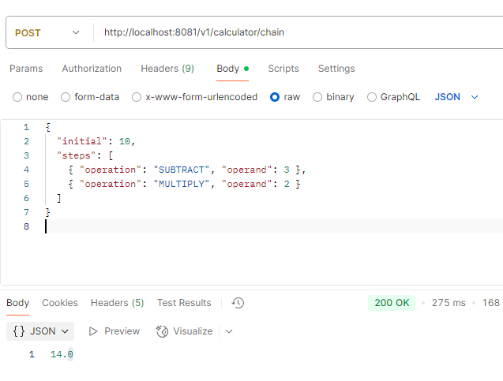
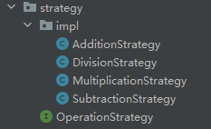
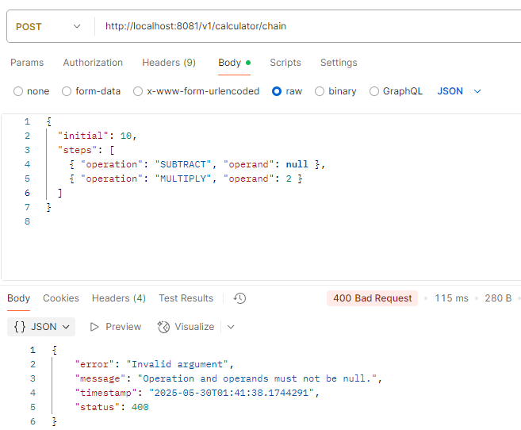

#  Extensible Calculator API

A Spring Boot-based calculator backend that supports precise arithmetic operations using BigDecimal, extensible logic via strategy pattern, and well-structured exception handling. The design follows key object-oriented principles including Open-Closed Principle and Inversion of Control (IoC) compatibility.

---

##  Features

-  Basic operations: ADD, SUBTRACT, MULTIPLY, DIVIDE
-  Chaining multiple operations sequentially
-  Easily extensible with new operations via Strategy Pattern
-  Centralized precision control using `BigDecimal`
- Global exception handling for consistent API errors
- Unit tests for normal and edge cases

---

##  Technologies

- Java 17+
- Spring Boot
- Maven
- JUnit 5

---

##  Requirements Mapping

### 1. Operations
Defined an `enum Operation` with:
```java
public enum Operation { ADD, SUBTRACT, MULTIPLY, DIVIDE }
```

### 2. Basic Calculation Method
Implemented in `Calculator.java`:
```java
public BigDecimal calculate(Operation op, Number num1, Number num2)
```
Ensures precision using `BigDecimal`.

### 3. Chaining Operations
Supports chaining operations via POST `/calculator/chain`.




### 4. Extensibility
New operations can be added by:
1. Creating a new class implementing `OperationStrategy`
2. Annotating it with `@Component`

No changes needed in `Calculator` or service logic.



### 5. IoC Compatibility
All services and strategies are injected by Spring. Easily testable and mockable.

### 6. Error Handling
Handled globally using `@RestControllerAdvice`. Includes:
- Division by zero → `ArithmeticException`
- Unsupported operations → `UnsupportedOperationException`
- Validation errors → `MethodArgumentNotValidException`




### 7. Testing
Tests are written using JUnit 5. Covered:
- Normal operations
- Edge cases like division by zero, null inputs


---

## API Sample Usage

### `POST /v1/calculator/calculate`
```json
{
  "num1": 10,
  "num2": 3,
  "operation": "DIVIDE"
}
```

### `POST /v1/calculator/chain`
```json
{
  "initial": 10,
  "steps": [
    { "operation": "SUBTRACT", "operand": 3 },
    { "operation": "MULTIPLY", "operand": 2 }
  ]
}
```

---

## ️ Precision Control

Default precision is managed centrally in `Constants.java`:
```java
public static final int DEFAULT_SCALE = 10;
public static final RoundingMode DEFAULT_ROUNDING = RoundingMode.HALF_UP;
```
Change the constant to apply new precision globally.

---

##  How to Add New Operations

To add a new operation (e.g., MODULO):
1. Implement the `OperationStrategy` interface
2. Return `"MODULO"` in `getOperation()`
3. Annotate the class with `@Component`


---

## ️ How to Run

```bash
git clone https://github.com/HarrisonHCH/Calculator.git
cd calculator
./mvnw spring-boot:run
```

Then access: `http://localhost:8081`

